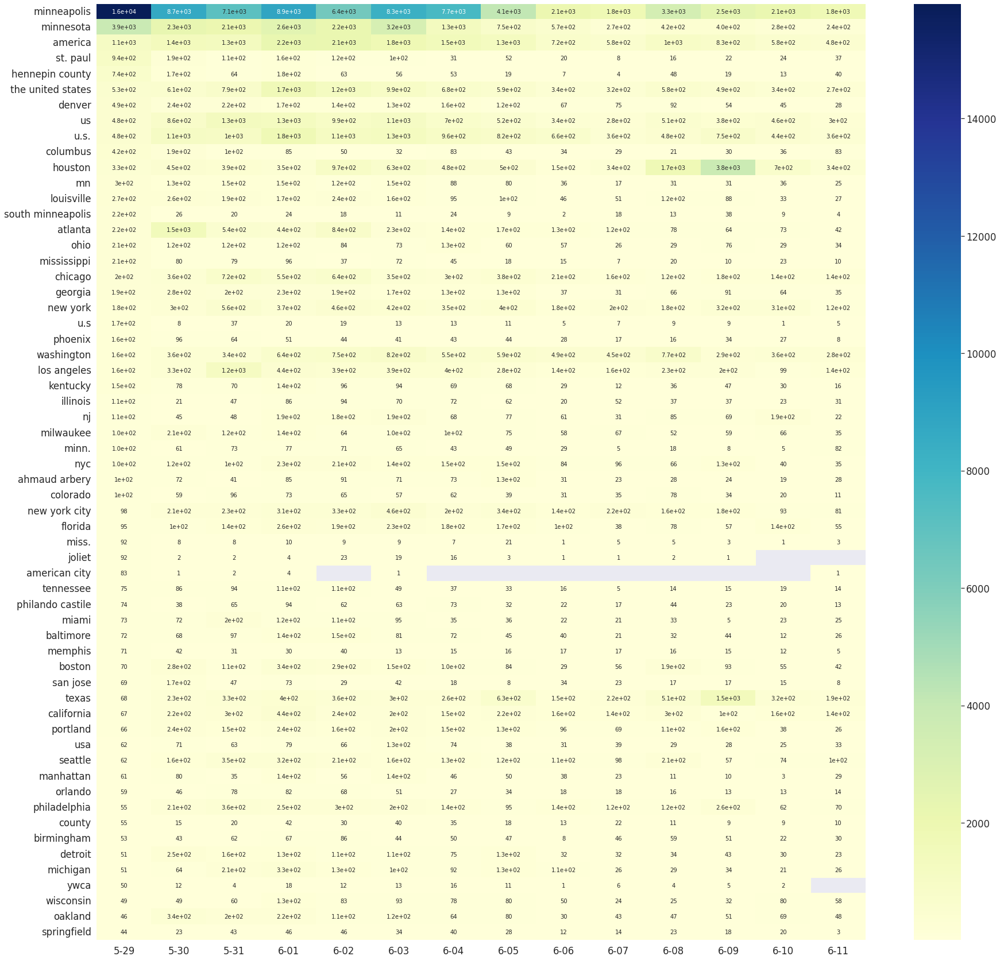

# 2021-online-language-offline-impact-main
In this project, I am taking the part to extract the locations of posts and convert them into readable text
I applied spaCy models to extract toponymy information from Facebook posts, it was a pretrained model specialized in extracting places entities from a sentence or a paragraph. Then by introducing a geocoder (Nominatim), the toponymy information were converted into a readable and easy to process format so that my teammates can do statistical analysis on them. The project was about studying people’s reaction on major social events and how it was spread around the Facebook networks.
An heatmap of number of post: 
